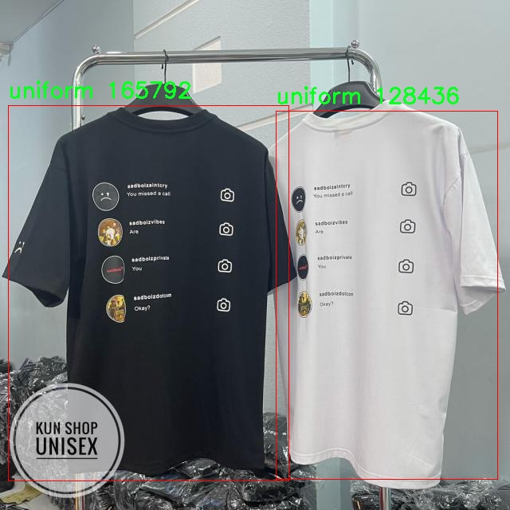

# 身份识别与服装类型检测检测系统源码分享
 # [一条龙教学YOLOV8标注好的数据集一键训练_70+全套改进创新点发刊_Web前端展示]

### 1.研究背景与意义

项目参考[AAAI Association for the Advancement of Artificial Intelligence](https://gitee.com/qunshansj/projects)

项目来源[AACV Association for the Advancement of Computer Vision](https://gitee.com/qunmasj/projects)

研究背景与意义

随着信息技术的迅猛发展，尤其是在计算机视觉和深度学习领域，身份识别与服装类型检测技术逐渐成为社会各界关注的热点。身份识别技术在安防、金融、交通等多个领域的应用日益广泛，能够有效提升社会管理和服务的智能化水平。而服装类型检测作为计算机视觉中的重要研究方向，不仅在零售行业的智能化管理中发挥着重要作用，还在社交媒体、在线购物等场景中为用户提供了个性化的服务体验。因此，基于改进YOLOv8的身份识别与服装类型检测系统的研究具有重要的理论价值和实际意义。

YOLO（You Only Look Once）系列模型因其高效的实时检测能力而受到广泛关注。YOLOv8作为该系列的最新版本，结合了深度学习的先进技术，能够在保证检测精度的同时，实现快速的目标识别。通过对YOLOv8模型的改进，可以进一步提升其在复杂场景下的表现，使其更好地适应身份识别与服装类型检测的需求。本研究将重点关注如何通过优化网络结构、调整超参数以及引入数据增强技术等手段，提升模型在特定任务上的性能。

在本研究中，我们使用的数据集包含1513张图像，涵盖了三类目标：身份证、非制服和制服。这一数据集的构建不仅为模型的训练提供了丰富的样本，也为后续的实验和验证奠定了基础。身份证作为身份识别的关键元素，其准确检测对于安全监控、身份验证等场景至关重要；而制服与非制服的分类则在教育、企业管理等领域具有重要的应用价值。通过对这三类目标的有效识别与分类，能够为实际应用提供更为精准的数据支持。

此外，随着社会对安全性和个性化服务需求的不断提升，基于计算机视觉的身份识别与服装类型检测系统的研究也面临着新的挑战。例如，如何在复杂背景、不同光照条件下保持高精度的检测，如何处理图像中的遮挡现象等，都是当前研究亟待解决的问题。因此，改进YOLOv8模型以适应这些挑战，不仅能够推动相关技术的发展，也为行业应用提供了更为可靠的解决方案。

综上所述，基于改进YOLOv8的身份识别与服装类型检测系统的研究，不仅具有重要的学术价值，也在实际应用中展现出广阔的前景。通过深入探讨模型的改进策略和应用场景，本研究旨在为推动智能识别技术的发展贡献力量，同时为相关领域的研究者和从业者提供有益的参考和借鉴。

### 2.图片演示


##### 注意：由于此博客编辑较早，上面“2.图片演示”和“3.视频演示”展示的系统图片或者视频可能为老版本，新版本在老版本的基础上升级如下：（实际效果以升级的新版本为准）

  （1）适配了YOLOV8的“目标检测”模型和“实例分割”模型，通过加载相应的权重（.pt）文件即可自适应加载模型。

  （2）支持“图片识别”、“视频识别”、“摄像头实时识别”三种识别模式。

  （3）支持“图片识别”、“视频识别”、“摄像头实时识别”三种识别结果保存导出，解决手动导出（容易卡顿出现爆内存）存在的问题，识别完自动保存结果并导出到tempDir中。

  （4）支持Web前端系统中的标题、背景图等自定义修改，后面提供修改教程。

  另外本项目提供训练的数据集和训练教程,暂不提供权重文件（best.pt）,需要您按照教程进行训练后实现图片演示和Web前端界面演示的效果。

### 3.视频演示

[3.1 视频演示](https://www.bilibili.com/video/BV1cJ4deQExR/)

### 4.数据集信息展示

##### 4.1 本项目数据集详细数据（类别数＆类别名）

nc: 3
names: ['id card', 'no-uniform', 'uniform']


##### 4.2 本项目数据集信息介绍

数据集信息展示

在本研究中，我们采用了名为“FinalProject”的数据集，以支持对YOLOv8模型在身份识别与服装类型检测系统中的改进。该数据集专门设计用于训练和评估深度学习模型，旨在提高其在复杂场景下的识别准确性和鲁棒性。数据集包含三种主要类别，分别为“id card”（身份证）、“no-uniform”（非制服）和“uniform”（制服），这些类别的选择反映了现实世界中身份识别和服装类型分类的多样性与复杂性。

“FinalProject”数据集的构建过程经过精心设计，确保了数据的多样性和代表性。每个类别均包含大量的样本，涵盖了不同的拍摄角度、光照条件和背景环境。这种多样性使得模型在训练过程中能够学习到更为丰富的特征，从而提高其在实际应用中的表现。例如，在“id card”类别中，数据集不仅包含传统的身份证照片，还包括不同国家和地区的身份证样本，以增强模型对各种身份证件的识别能力。在“no-uniform”类别中，样本涵盖了各种休闲服装、职业装以及其他非制服类型的服装，确保模型能够有效区分不同风格的服装。而在“uniform”类别中，数据集则收录了多种职业制服的图像，如警察、医生、教师等，帮助模型学习到制服的特征。

为了进一步提升数据集的有效性，数据样本在标注过程中采用了高标准的质量控制措施。每个样本都经过多轮审核，确保标注的准确性和一致性。这种严谨的标注过程为后续的模型训练提供了可靠的基础，减少了因标注错误而导致的训练偏差。此外，数据集还考虑到了隐私保护和伦理问题，所有涉及个人身份信息的样本均经过匿名处理，确保不泄露任何个人隐私。

在模型训练过程中，研究者们将“FinalProject”数据集与YOLOv8模型相结合，旨在通过深度学习技术提升身份识别与服装类型检测的准确性和效率。YOLOv8作为一种先进的目标检测算法，具备实时处理的能力，能够在复杂的场景中快速识别和分类目标。通过对“FinalProject”数据集的训练，研究者们期望模型能够在实际应用中实现高效的身份验证和服装类型识别，进而推动相关领域的发展。

综上所述，“FinalProject”数据集不仅为YOLOv8模型的训练提供了丰富的样本和高质量的标注，还为身份识别与服装类型检测的研究提供了坚实的基础。通过不断优化和改进该数据集，研究者们希望能够在未来的工作中实现更高的识别精度和更广泛的应用场景，为智能监控、安防系统以及其他相关领域的技术进步贡献力量。





### 5.全套项目环境部署视频教程（零基础手把手教学）

[5.1 环境部署教程链接（零基础手把手教学）](https://www.ixigua.com/7404473917358506534?logTag=c807d0cbc21c0ef59de5)


[5.2 安装Python虚拟环境创建和依赖库安装视频教程链接（零基础手把手教学）](https://www.ixigua.com/7404474678003106304?logTag=1f1041108cd1f708b01a)

### 6.手把手YOLOV8训练视频教程（零基础小白有手就能学会）

[6.1 手把手YOLOV8训练视频教程（零基础小白有手就能学会）](https://www.ixigua.com/7404477157818401292?logTag=d31a2dfd1983c9668658)

### 7.70+种全套YOLOV8创新点代码加载调参视频教程（一键加载写好的改进模型的配置文件）

[7.1 70+种全套YOLOV8创新点代码加载调参视频教程（一键加载写好的改进模型的配置文件）](https://www.ixigua.com/7404478314661806627?logTag=29066f8288e3f4eea3a4)

### 8.70+种全套YOLOV8创新点原理讲解（非科班也可以轻松写刊发刊，V10版本正在科研待更新）

由于篇幅限制，每个创新点的具体原理讲解就不一一展开，具体见下列网址中的创新点对应子项目的技术原理博客网址【Blog】：


[8.1 70+种全套YOLOV8创新点原理讲解链接](https://gitee.com/qunmasj/good)

### 9.系统功能展示（检测对象为举例，实际内容以本项目数据集为准）

图9.1.系统支持检测结果表格显示

  图9.2.系统支持置信度和IOU阈值手动调节

  图9.3.系统支持自定义加载权重文件best.pt(需要你通过步骤5中训练获得)

  图9.4.系统支持摄像头实时识别

  图9.5.系统支持图片识别

  图9.6.系统支持视频识别

  图9.7.系统支持识别结果文件自动保存

  图9.8.系统支持Excel导出检测结果数据


### 10.原始YOLOV8算法原理

原始YOLOv8算法原理

YOLOv8作为目标检测领域的最新进展，继承并优化了前代YOLO模型的优点，同时在多个方面进行了创新，旨在实现更高的检测精度和更快的推理速度。该模型的结构主要由输入层、主干网络、颈部网络和头部网络组成，每个部分都经过精心设计，以提高整体性能和效率。

在输入层，YOLOv8首先对输入图像进行缩放，以适应模型所需的输入尺寸。这一过程确保了不同尺寸的图像能够被有效处理，同时也为后续的特征提取打下了基础。主干网络是YOLOv8的核心部分，其主要功能是通过卷积操作对图像进行下采样，从而提取出丰富的特征信息。与之前的YOLO版本相比，YOLOv8在主干网络中引入了C2F模块，这一模块通过更轻量化的设计替代了传统的C3模块，采用了3×3的卷积核和更深的网络结构，使得特征提取更加高效。

在特征提取过程中，YOLOv8的每个卷积层都结合了批归一化和SiLUR激活函数，这不仅加速了模型的收敛速度，还增强了模型对非线性特征的表达能力。主干网络的末尾使用了SPPFl块，该块通过三个最大池化层来处理多尺度特征，进一步提升了网络的特征抽象能力，使得模型能够更好地适应不同尺寸目标的检测需求。

颈部网络是YOLOv8中一个重要的创新部分，采用了特征金字塔网络（FPN）和路径聚合网络（PAN）的组合。这一结构的设计旨在融合来自不同尺度的特征图信息，从而为后续的目标检测提供更加丰富的上下文信息。特别是，YOLOv8在颈部网络中引入了BiFPN网络，通过高效的双向跨尺度连接和加权特征融合，显著提高了模型对不同尺度特征信息的提取速度和准确性。这种设计不仅提升了模型的检测性能，还使得YOLOv8在处理复杂场景时表现得更加稳定。

在头部网络部分，YOLOv8采用了解耦的检测头，替代了传统的耦合头结构。解耦头通过两个并行的卷积分支分别计算回归和类别的损失，这种设计使得模型在处理目标检测任务时能够更为灵活和高效。通过将回归和分类任务分开处理，YOLOv8能够更好地优化每个任务的损失函数，从而提高检测精度。此外，YOLOv8还引入了有错目标检测的机制，进一步增强了模型在复杂场景下的鲁棒性。

YOLOv8的轻量化设计是其一大亮点，尤其是在YOLOv8n模型中，使用了更轻量化的C2F模块和解耦头，显著降低了模型的计算复杂度。这使得YOLOv8n在移动设备和边缘计算环境中得以广泛应用，满足了实时目标检测的需求。模型的深度、宽度和通道数通过depth_factor、width_factor和ratio等参数进行灵活设置，用户可以根据具体应用场景的需求，调整模型的结构以实现最佳性能。

在实际应用中，YOLOv8展现出了优越的推理速度和高精度的检测能力，成为了目标检测领域的一个重要工具。其原生支持自定义数据集的特性，使得研究人员和开发者能够更方便地进行模型训练和调整，进一步推动了目标检测技术的发展。通过不断优化和创新，YOLOv8不仅提升了目标检测的效率和准确性，也为未来的研究提供了新的思路和方向。

总的来说，YOLOv8的原始算法原理体现了对深度学习技术的深刻理解和应用，其在网络结构、特征提取、特征融合和检测机制等方面的创新，使得这一模型在目标检测领域中脱颖而出。随着YOLOv8的广泛应用和持续优化，未来的目标检测技术将更加智能化和高效化，为各行各业带来更多的可能性。


### 11.项目核心源码讲解（再也不用担心看不懂代码逻辑）

#### 11.1 code\ultralytics\data\explorer\explorer.py

以下是对代码中最核心部分的提炼和详细中文注释：

```python
class Explorer:
    def __init__(self, data: Union[str, Path] = "coco128.yaml", model: str = "yolov8n.pt", uri: str = "~/ultralytics/explorer") -> None:
        # 初始化Explorer类，连接到LanceDB数据库，加载YOLO模型和数据集
        checks.check_requirements(["lancedb>=0.4.3", "duckdb"])  # 检查依赖库
        import lancedb
        self.connection = lancedb.connect(uri)  # 连接到LanceDB
        self.table_name = Path(data).name.lower() + "_" + model.lower()  # 设置表名
        self.model = YOLO(model)  # 加载YOLO模型
        self.data = data  # 数据集路径
        self.choice_set = None  # 选择的数据集
        self.table = None  # 数据表
        self.progress = 0  # 进度

    def create_embeddings_table(self, force: bool = False, split: str = "train") -> None:
        """
        创建包含数据集中图像嵌入的LanceDB表。如果表已存在，则重用它。
        Args:
            force (bool): 是否覆盖现有表。默认为False。
            split (str): 使用的数据集分割。默认为'train'。
        """
        if self.table is not None and not force:
            LOGGER.info("Table already exists. Reusing it. Pass force=True to overwrite it.")
            return
        if self.table_name in self.connection.table_names() and not force:
            LOGGER.info(f"Table {self.table_name} already exists. Reusing it. Pass force=True to overwrite it.")
            self.table = self.connection.open_table(self.table_name)
            self.progress = 1
            return
        if self.data is None:
            raise ValueError("Data must be provided to create embeddings table")

        data_info = check_det_dataset(self.data)  # 检查数据集
        if split not in data_info:
            raise ValueError(f"Split {split} is not found in the dataset. Available keys in the dataset are {list(data_info.keys())}")

        choice_set = data_info[split]
        choice_set = choice_set if isinstance(choice_set, list) else [choice_set]
        self.choice_set = choice_set
        dataset = ExplorerDataset(img_path=choice_set, data=data_info, augment=False, cache=False, task=self.model.task)

        # 创建表模式
        batch = dataset[0]
        vector_size = self.model.embed(batch["im_file"], verbose=False)[0].shape[0]  # 获取嵌入向量的维度
        table = self.connection.create_table(self.table_name, schema=get_table_schema(vector_size), mode="overwrite")  # 创建表
        table.add(self._yield_batches(dataset, data_info, self.model, exclude_keys=["img", "ratio_pad", "resized_shape", "ori_shape", "batch_idx"]))  # 添加数据

        self.table = table  # 保存表

    def query(self, imgs: Union[str, np.ndarray, List[str], List[np.ndarray]] = None, limit: int = 25) -> Any:
        """
        查询表中相似的图像。接受单个图像或图像列表。
        Args:
            imgs (str or list): 图像路径或图像路径列表。
            limit (int): 返回的结果数量。
        Returns:
            (pyarrow.Table): 包含结果的箭头表。
        """
        if self.table is None:
            raise ValueError("Table is not created. Please create the table first.")
        if isinstance(imgs, str):
            imgs = [imgs]
        assert isinstance(imgs, list), f"img must be a string or a list of strings. Got {type(imgs)}"
        embeds = self.model.embed(imgs)  # 获取图像的嵌入向量
        embeds = torch.mean(torch.stack(embeds), 0).cpu().numpy() if len(embeds) > 1 else embeds[0].cpu().numpy()  # 计算多个图像的平均嵌入
        return self.table.search(embeds).limit(limit).to_arrow()  # 查询相似图像并返回结果

    def similarity_index(self, max_dist: float = 0.2, top_k: float = None, force: bool = False) -> DataFrame:
        """
        计算表中所有图像的相似性索引。
        Args:
            max_dist (float): 考虑的最大L2距离。默认为0.2。
            top_k (float): 考虑的最近数据点的百分比。默认为None。
            force (bool): 是否覆盖现有相似性索引。默认为True。
        Returns:
            (pandas.DataFrame): 包含相似性索引的数据框。
        """
        if self.table is None:
            raise ValueError("Table is not created. Please create the table first.")
        sim_idx_table_name = f"{self.sim_idx_base_name}_thres_{max_dist}_top_{top_k}".lower()
        if sim_idx_table_name in self.connection.table_names() and not force:
            LOGGER.info("Similarity matrix already exists. Reusing it. Pass force=True to overwrite it.")
            return self.connection.open_table(sim_idx_table_name).to_pandas()

        if top_k and not (1.0 >= top_k >= 0.0):
            raise ValueError(f"top_k must be between 0.0 and 1.0. Got {top_k}")
        if max_dist < 0.0:
            raise ValueError(f"max_dist must be greater than 0. Got {max_dist}")

        top_k = int(top_k * len(self.table)) if top_k else len(self.table)
        top_k = max(top_k, 1)
        features = self.table.to_lance().to_table(columns=["vector", "im_file"]).to_pydict()
        im_files = features["im_file"]
        embeddings = features["vector"]

        sim_table = self.connection.create_table(sim_idx_table_name, schema=get_sim_index_schema(), mode="overwrite")

        def _yield_sim_idx():
            """生成包含相似性索引和距离的数据框。"""
            for i in tqdm(range(len(embeddings))):
                sim_idx = self.table.search(embeddings[i]).limit(top_k).to_pandas().query(f"_distance <= {max_dist}")
                yield [
                    {
                        "idx": i,
                        "im_file": im_files[i],
                        "count": len(sim_idx),
                        "sim_im_files": sim_idx["im_file"].tolist(),
                    }
                ]

        sim_table.add(_yield_sim_idx())
        self.sim_index = sim_table
        return sim_table.to_pandas()
```

### 核心部分分析
1. **Explorer类**: 该类是整个图像查询和相似性计算的核心，负责初始化、创建嵌入表、查询相似图像以及计算相似性索引等功能。
2. **create_embeddings_table方法**: 负责创建一个LanceDB表，存储图像的嵌入向量。该方法首先检查表是否已存在，如果存在则重用；如果不存在，则加载数据集并计算嵌入向量，最后将其存储在表中。
3. **query方法**: 该方法用于查询与给定图像相似的图像，返回结果为一个箭头表。支持单个图像或多个图像的查询。
4. **similarity_index方法**: 计算表中所有图像的相似性索引，返回一个包含每个图像相似图像及其距离的数据框。该方法允许设置最大距离和返回的最近邻数量。

### 注释说明
- 每个方法都有详细的注释，解释了其功能、参数和返回值，便于理解代码的逻辑和使用方法。
- 重要的逻辑部分和条件判断也进行了注释，以帮助理解代码的执行流程。

这个文件 `explorer.py` 是 Ultralytics YOLO 项目的一部分，主要用于处理和探索图像数据集。文件中定义了两个主要的类：`ExplorerDataset` 和 `Explorer`，它们分别负责数据集的加载和图像相似性查询等功能。

`ExplorerDataset` 类继承自 `YOLODataset`，主要负责加载图像数据。它的 `load_image` 方法根据索引加载图像，如果图像已经缓存则直接返回，否则会尝试从文件中读取图像或加载 `.npy` 文件。该类还提供了 `build_transforms` 方法，用于创建图像转换，主要用于数据预处理。

`Explorer` 类是该模块的核心，负责与 LanceDB 数据库进行交互。它的构造函数接受数据集路径、模型路径和数据库 URI，并检查所需的依赖项。该类的 `create_embeddings_table` 方法用于创建一个包含图像嵌入的数据库表，如果表已经存在则可以选择覆盖。它会检查数据集的完整性，并使用 YOLO 模型生成图像的嵌入向量。

在 `Explorer` 类中，`query` 方法允许用户根据输入的图像查询相似图像，返回一个包含查询结果的表格。`sql_query` 方法则支持使用 SQL 语句对数据库进行查询，返回结果可以是 Pandas DataFrame 或 Arrow 表格。

此外，`Explorer` 类还提供了多种可视化和分析功能，例如 `plot_sql_query` 用于绘制 SQL 查询结果，`get_similar` 用于获取相似图像，`plot_similar` 用于绘制相似图像的可视化结果。`similarity_index` 方法计算所有图像的相似性索引，返回一个包含相似图像及其距离的 DataFrame。

该文件还包含一些辅助方法，例如 `_check_imgs_or_idxs` 用于验证输入的图像或索引，`ask_ai` 方法可以根据自然语言查询生成 SQL 查询并执行。

总的来说，`explorer.py` 文件为用户提供了一种方便的方式来探索和分析图像数据集，利用 YOLO 模型进行图像嵌入和相似性查询，结合数据库的强大功能，实现高效的数据处理和可视化。

#### 11.2 code\ultralytics\models\fastsam\predict.py

以下是代码中最核心的部分，并附上详细的中文注释：

```python
import torch
from ultralytics.engine.results import Results
from ultralytics.models.fastsam.utils import bbox_iou
from ultralytics.models.yolo.detect.predict import DetectionPredictor
from ultralytics.utils import ops

class FastSAMPredictor(DetectionPredictor):
    """
    FastSAMPredictor类专门用于在Ultralytics YOLO框架中进行快速SAM（Segment Anything Model）分割预测任务。
    该类扩展了DetectionPredictor，定制了预测管道，特别针对快速SAM进行了调整。
    """

    def __init__(self, cfg=DEFAULT_CFG, overrides=None, _callbacks=None):
        """
        初始化FastSAMPredictor类，继承自DetectionPredictor，并将任务设置为'分割'。

        Args:
            cfg (dict): 预测的配置参数。
            overrides (dict, optional): 可选的参数覆盖，用于自定义行为。
            _callbacks (dict, optional): 可选的回调函数列表，在预测过程中调用。
        """
        super().__init__(cfg, overrides, _callbacks)
        self.args.task = "segment"  # 设置任务为分割

    def postprocess(self, preds, img, orig_imgs):
        """
        对预测结果进行后处理，包括非最大抑制和将框缩放到原始图像大小，并返回最终结果。

        Args:
            preds (list): 模型的原始输出预测。
            img (torch.Tensor): 处理后的图像张量。
            orig_imgs (list | torch.Tensor): 原始图像或图像列表。

        Returns:
            (list): 包含处理后的框、掩码和其他元数据的Results对象列表。
        """
        # 应用非最大抑制（NMS）来过滤重叠的预测框
        p = ops.non_max_suppression(
            preds[0],
            self.args.conf,  # 置信度阈值
            self.args.iou,   # IOU阈值
            agnostic=self.args.agnostic_nms,  # 是否对类别不敏感
            max_det=self.args.max_det,  # 最大检测数量
            nc=1,  # 设置为1类，因为SAM没有类别预测
            classes=self.args.classes,
        )

        # 创建一个全框，用于存储最终的框信息
        full_box = torch.zeros(p[0].shape[1], device=p[0].device)
        full_box[2], full_box[3], full_box[4], full_box[6:] = img.shape[3], img.shape[2], 1.0, 1.0
        full_box = full_box.view(1, -1)

        # 计算IOU并更新full_box
        critical_iou_index = bbox_iou(full_box[0][:4], p[0][:, :4], iou_thres=0.9, image_shape=img.shape[2:])
        if critical_iou_index.numel() != 0:
            full_box[0][4] = p[0][critical_iou_index][:, 4]
            full_box[0][6:] = p[0][critical_iou_index][:, 6:]
            p[0][critical_iou_index] = full_box  # 更新预测框

        # 如果输入图像是张量而不是列表，则转换为numpy数组
        if not isinstance(orig_imgs, list):
            orig_imgs = ops.convert_torch2numpy_batch(orig_imgs)

        results = []  # 存储最终结果
        proto = preds[1][-1] if len(preds[1]) == 3 else preds[1]  # 获取掩码原型

        # 遍历每个预测结果
        for i, pred in enumerate(p):
            orig_img = orig_imgs[i]  # 获取原始图像
            img_path = self.batch[0][i]  # 获取图像路径

            if not len(pred):  # 如果没有预测框
                masks = None
            elif self.args.retina_masks:  # 使用Retina掩码
                pred[:, :4] = ops.scale_boxes(img.shape[2:], pred[:, :4], orig_img.shape)  # 缩放框
                masks = ops.process_mask_native(proto[i], pred[:, 6:], pred[:, :4], orig_img.shape[:2])  # 处理掩码
            else:  # 默认处理掩码
                masks = ops.process_mask(proto[i], pred[:, 6:], pred[:, :4], img.shape[2:], upsample=True)  # 处理掩码
                pred[:, :4] = ops.scale_boxes(img.shape[2:], pred[:, :4], orig_img.shape)  # 缩放框

            # 将结果添加到结果列表中
            results.append(Results(orig_img, path=img_path, names=self.model.names, boxes=pred[:, :6], masks=masks))

        return results  # 返回最终结果
```

### 代码核心部分说明：
1. **类定义**：`FastSAMPredictor`类继承自`DetectionPredictor`，用于快速分割任务。
2. **初始化方法**：设置任务为分割，并调用父类的初始化方法。
3. **后处理方法**：`postprocess`方法负责对模型的原始预测结果进行后处理，包括应用非最大抑制、缩放框和处理掩码，最终返回处理后的结果列表。

该程序文件是一个用于快速分割任务的预测器，名为 `FastSAMPredictor`，它是基于 Ultralytics YOLO 框架的。这个类继承自 `DetectionPredictor`，并针对快速 SAM（Segment Anything Model）分割预测任务进行了定制。其主要功能是调整预测流程，特别是在后处理步骤中，结合了掩膜预测和非最大抑制（NMS），并优化了单类分割的处理。

在初始化方法 `__init__` 中，构造函数接受配置参数 `cfg`、可选的参数覆盖 `overrides` 和可选的回调函数 `_callbacks`。通过调用父类的构造函数，设置任务类型为“分割”。

`postprocess` 方法是该类的核心功能之一，负责对模型的原始输出进行后处理，包括非最大抑制和将边界框缩放到原始图像大小。该方法接收三个参数：`preds` 是模型的原始输出，`img` 是处理后的图像张量，`orig_imgs` 是原始图像或图像列表。该方法返回一个包含处理后结果的列表，每个结果对象包含处理后的边界框、掩膜和其他元数据。

在 `postprocess` 方法中，首先调用 `ops.non_max_suppression` 对预测结果进行非最大抑制，去除冗余的检测框。接着，创建一个全框 `full_box`，并根据输入图像的形状进行初始化。通过计算与全框的 IoU（交并比），找到关键的 IoU 索引，并根据这些索引更新预测结果。

接下来，方法检查输入的原始图像是否为列表，如果不是，则将其转换为 NumPy 格式。然后，处理每个预测结果，若没有检测到目标，则掩膜为 `None`；如果需要返回掩膜，则根据不同的条件调用相应的掩膜处理函数。最后，将处理后的结果封装为 `Results` 对象，并返回所有结果的列表。

总体而言，该文件实现了一个高效的分割预测器，专注于快速处理和优化单类分割任务，利用 Ultralytics YOLO 框架的强大功能。

#### 11.3 ui.py

```python
import sys
import subprocess

def run_script(script_path):
    """
    使用当前 Python 环境运行指定的脚本。

    Args:
        script_path (str): 要运行的脚本路径

    Returns:
        None
    """
    # 获取当前 Python 解释器的路径
    python_path = sys.executable

    # 构建运行命令
    command = f'"{python_path}" -m streamlit run "{script_path}"'

    # 执行命令
    result = subprocess.run(command, shell=True)
    if result.returncode != 0:
        print("脚本运行出错。")


# 实例化并运行应用
if __name__ == "__main__":
    # 指定您的脚本路径
    script_path = "web.py"  # 这里可以直接指定脚本路径

    # 运行脚本
    run_script(script_path)
```

### 代码注释说明：

1. **导入模块**：
   - `import sys`：导入 sys 模块以访问与 Python 解释器相关的变量和函数。
   - `import subprocess`：导入 subprocess 模块以便在 Python 中执行外部命令。

2. **定义函数 `run_script`**：
   - 该函数接收一个参数 `script_path`，表示要运行的 Python 脚本的路径。
   - 函数内部首先获取当前 Python 解释器的路径，以便在后续命令中使用。

3. **构建命令**：
   - 使用格式化字符串构建命令，命令格式为 `python -m streamlit run <script_path>`，用于运行指定的 Streamlit 应用。

4. **执行命令**：
   - 使用 `subprocess.run` 执行构建好的命令，`shell=True` 允许在 shell 中执行命令。
   - 检查命令的返回码，如果返回码不为 0，表示脚本运行出错，打印错误信息。

5. **主程序入口**：
   - `if __name__ == "__main__":` 确保只有在直接运行该脚本时才会执行以下代码。
   - 指定要运行的脚本路径（在这里是 `web.py`）。
   - 调用 `run_script` 函数以运行指定的脚本。

这个程序文件名为 `ui.py`，主要功能是通过当前的 Python 环境运行一个指定的脚本。程序首先导入了必要的模块，包括 `sys`、`os` 和 `subprocess`，以及一个自定义的路径处理模块 `abs_path`。

在 `run_script` 函数中，程序接收一个参数 `script_path`，这是要运行的脚本的路径。函数首先获取当前 Python 解释器的路径，接着构建一个命令字符串，该命令用于调用 `streamlit` 来运行指定的脚本。具体来说，命令的格式是 `python -m streamlit run "script_path"`，其中 `python` 是当前 Python 解释器的路径，`script_path` 是传入的脚本路径。

然后，程序使用 `subprocess.run` 方法执行这个命令。`shell=True` 参数表示命令将在一个新的 shell 中运行。执行后，程序检查返回的结果，如果返回码不为零，说明脚本运行过程中出现了错误，程序会打印出“脚本运行出错”的提示信息。

在文件的最后部分，程序通过 `if __name__ == "__main__":` 判断是否是直接运行该脚本。如果是，程序会指定一个脚本路径，这里是通过 `abs_path` 函数获取的 `web.py` 的绝对路径，然后调用 `run_script` 函数来运行这个脚本。

总体来说，这个程序的主要作用是为运行 `web.py` 提供一个简便的入口，确保使用当前 Python 环境来执行该脚本，并处理可能出现的错误。

#### 11.4 70+种YOLOv8算法改进源码大全和调试加载训练教程（非必要）\ultralytics\models\sam\modules\encoders.py

以下是代码中最核心的部分，并附上详细的中文注释：

```python
import torch
import torch.nn as nn
import torch.nn.functional as F

class ImageEncoderViT(nn.Module):
    """
    使用视觉变换器（ViT）架构的图像编码器，将图像编码为紧凑的潜在空间。
    编码器将图像分割为多个补丁，并通过一系列变换块处理这些补丁。
    编码后的补丁经过一个“颈部”模块生成最终的编码表示。
    """

    def __init__(self, img_size: int = 1024, patch_size: int = 16, in_chans: int = 3, embed_dim: int = 768, depth: int = 12, num_heads: int = 12):
        """
        初始化图像编码器的参数。

        Args:
            img_size (int): 输入图像的大小（假设为正方形）。
            patch_size (int): 补丁的大小。
            in_chans (int): 输入图像的通道数。
            embed_dim (int): 补丁嵌入的维度。
            depth (int): ViT的深度（变换块的数量）。
            num_heads (int): 每个ViT块中的注意力头数。
        """
        super().__init__()
        self.img_size = img_size

        # 补丁嵌入模块，将图像分割为补丁并进行嵌入
        self.patch_embed = PatchEmbed(
            kernel_size=(patch_size, patch_size),
            stride=(patch_size, patch_size),
            in_chans=in_chans,
            embed_dim=embed_dim,
        )

        # 位置嵌入，用于补丁的绝对位置编码
        self.pos_embed = nn.Parameter(torch.zeros(1, img_size // patch_size, img_size // patch_size, embed_dim))

        # 变换块列表
        self.blocks = nn.ModuleList()
        for i in range(depth):
            block = Block(
                dim=embed_dim,
                num_heads=num_heads,
            )
            self.blocks.append(block)

        # 颈部模块，进一步处理输出
        self.neck = nn.Sequential(
            nn.Conv2d(embed_dim, 256, kernel_size=1, bias=False),
            nn.LayerNorm(256),
            nn.Conv2d(256, 256, kernel_size=3, padding=1, bias=False),
            nn.LayerNorm(256),
        )

    def forward(self, x: torch.Tensor) -> torch.Tensor:
        """处理输入，通过补丁嵌入、位置嵌入、变换块和颈部模块。"""
        x = self.patch_embed(x)  # 将输入图像分割为补丁并嵌入
        x = x + self.pos_embed  # 添加位置嵌入
        for blk in self.blocks:  # 通过所有变换块
            x = blk(x)
        return self.neck(x.permute(0, 3, 1, 2))  # 调整维度并通过颈部模块

class PatchEmbed(nn.Module):
    """图像到补丁嵌入的模块。"""

    def __init__(self, kernel_size: Tuple[int, int] = (16, 16), stride: Tuple[int, int] = (16, 16), in_chans: int = 3, embed_dim: int = 768) -> None:
        """
        初始化补丁嵌入模块。

        Args:
            kernel_size (Tuple): 投影层的卷积核大小。
            stride (Tuple): 投影层的步幅。
            in_chans (int): 输入图像的通道数。
            embed_dim (int): 补丁嵌入的维度。
        """
        super().__init__()
        self.proj = nn.Conv2d(in_chans, embed_dim, kernel_size=kernel_size, stride=stride)

    def forward(self, x: torch.Tensor) -> torch.Tensor:
        """通过卷积计算补丁嵌入，并调整结果张量的维度。"""
        return self.proj(x).permute(0, 2, 3, 1)  # 将输出从[B, C, H, W]转换为[B, H, W, C]

class Block(nn.Module):
    """变换块，支持窗口注意力和残差传播。"""

    def __init__(self, dim: int, num_heads: int) -> None:
        """
        初始化变换块。

        Args:
            dim (int): 输入通道数。
            num_heads (int): 注意力头数。
        """
        super().__init__()
        self.norm1 = nn.LayerNorm(dim)  # 归一化层
        self.attn = Attention(dim, num_heads=num_heads)  # 注意力模块
        self.norm2 = nn.LayerNorm(dim)  # 归一化层
        self.mlp = MLPBlock(embedding_dim=dim)  # MLP模块

    def forward(self, x: torch.Tensor) -> torch.Tensor:
        """执行变换块的前向传播。"""
        shortcut = x  # 残差连接
        x = self.norm1(x)  # 归一化
        x = self.attn(x)  # 注意力计算
        x = shortcut + x  # 残差连接
        return x + self.mlp(self.norm2(x))  # 最终输出

class Attention(nn.Module):
    """多头注意力模块。"""

    def __init__(self, dim: int, num_heads: int) -> None:
        """
        初始化注意力模块。

        Args:
            dim (int): 输入通道数。
            num_heads (int): 注意力头数。
        """
        super().__init__()
        self.num_heads = num_heads
        head_dim = dim // num_heads
        self.scale = head_dim ** -0.5  # 缩放因子

        self.qkv = nn.Linear(dim, dim * 3)  # 查询、键、值的线性变换
        self.proj = nn.Linear(dim, dim)  # 输出投影

    def forward(self, x: torch.Tensor) -> torch.Tensor:
        """执行注意力计算。"""
        B, H, W, _ = x.shape
        qkv = self.qkv(x).reshape(B, H * W, 3, self.num_heads, -1).permute(2, 0, 3, 1, 4)  # 计算qkv
        q, k, v = qkv.reshape(3, B * self.num_heads, H * W, -1).unbind(0)  # 分离q、k、v

        attn = (q * self.scale) @ k.transpose(-2, -1)  # 计算注意力分数
        attn = attn.softmax(dim=-1)  # 归一化
        x = (attn @ v).view(B, self.num_heads, H, W, -1).permute(0, 2, 3, 1, 4).reshape(B, H, W, -1)  # 输出
        return self.proj(x)  # 投影到输出维度
```

### 代码核心部分解释
1. **ImageEncoderViT**: 这是主要的图像编码器类，使用ViT架构来处理输入图像。它将图像分割为补丁，并通过多个变换块进行处理，最后通过颈部模块生成最终的编码表示。

2. **PatchEmbed**: 这个模块负责将输入图像分割为补丁并进行嵌入，使用卷积操作实现。

3. **Block**: 变换块的实现，包含注意力机制和MLP（多层感知机），并使用残差连接。

4. **Attention**: 多头注意力机制的实现，计算查询、键、值的注意力分数，并生成输出。

这些部分共同构成了图像编码器的核心功能，能够将输入图像转换为潜在空间的表示。

这个程序文件实现了一个图像编码器，基于视觉变换器（Vision Transformer, ViT）架构，旨在将输入图像编码为紧凑的潜在空间表示。该编码器将图像分割成多个小块（patches），并通过一系列变换块（transformer blocks）处理这些小块。最终，经过一个“neck”模块进一步处理后，生成最终的编码表示。

在类的构造函数中，定义了一些重要的参数，包括输入图像的大小、每个小块的大小、输入通道数、嵌入维度、变换块的深度、注意力头的数量等。构造函数中还初始化了小块嵌入模块（PatchEmbed），绝对位置嵌入（如果启用），多个变换块，以及用于进一步处理输出的“neck”模块。

在前向传播方法中，输入图像首先通过小块嵌入模块进行处理，如果存在位置嵌入，则将其添加到输出中。接着，输出通过所有的变换块进行处理，最后经过“neck”模块，输出最终的编码结果。

此外，文件中还定义了一个提示编码器（PromptEncoder），用于编码不同类型的提示（如点、框和掩码），以便输入到掩码解码器中。这个编码器生成稀疏和密集的嵌入，能够处理多种输入形式。

提示编码器的构造函数中，定义了嵌入维度、输入图像大小、图像嵌入大小等参数，并初始化了随机位置嵌入模块、点嵌入、掩码下采样网络等。它还提供了多个方法来嵌入点、框和掩码输入。

在位置编码部分，使用随机空间频率生成位置编码，以增强模型对位置信息的学习能力。这个位置编码模块可以根据输入图像的大小生成相应的编码，并且支持对未归一化坐标的处理。

文件中还实现了变换块（Block）和注意力模块（Attention），这些模块支持窗口注意力和残差传播。变换块包含了标准的层归一化、注意力机制和多层感知机（MLP）结构。注意力模块则实现了多头注意力机制，并支持相对位置编码。

整体而言，这个程序文件提供了一个功能强大的图像编码器，结合了现代深度学习技术，能够有效地处理图像数据并提取有用的特征表示。

#### 11.5 code\ultralytics\utils\callbacks\wb.py

以下是代码中最核心的部分，并附上详细的中文注释：

```python
# 导入必要的库
import numpy as np
import pandas as pd
import wandb as wb  # 导入 Weights & Biases 库用于实验跟踪和可视化

_processed_plots = {}  # 用于存储已处理的图表，以避免重复记录

def _custom_table(x, y, classes, title="Precision Recall Curve", x_title="Recall", y_title="Precision"):
    """
    创建并记录自定义的精确度-召回率曲线可视化。

    参数:
        x (List): x轴的值，长度为 N。
        y (List): y轴的值，长度为 N。
        classes (List): 每个点的类别标签，长度为 N。
        title (str, optional): 图表标题，默认为 'Precision Recall Curve'。
        x_title (str, optional): x轴标签，默认为 'Recall'。
        y_title (str, optional): y轴标签，默认为 'Precision'。

    返回:
        (wandb.Object): 适合记录的 wandb 对象，展示自定义的指标可视化。
    """
    # 创建一个 DataFrame 用于存储 x, y 和类信息
    df = pd.DataFrame({"class": classes, "y": y, "x": x}).round(3)
    fields = {"x": "x", "y": "y", "class": "class"}
    string_fields = {"title": title, "x-axis-title": x_title, "y-axis-title": y_title}
    
    # 使用 wandb.plot_table 记录表格
    return wb.plot_table(
        "wandb/area-under-curve/v0", wb.Table(dataframe=df), fields=fields, string_fields=string_fields
    )

def _plot_curve(x, y, names=None, id="precision-recall", title="Precision Recall Curve", x_title="Recall", y_title="Precision", num_x=100, only_mean=False):
    """
    记录指标曲线可视化。

    参数:
        x (np.ndarray): x轴的数据点，长度为 N。
        y (np.ndarray): y轴的数据点，形状为 CxN，C 表示类别数量。
        names (list, optional): y轴数据对应的类别名称，长度为 C。
        id (str, optional): 在 wandb 中记录数据的唯一标识符，默认为 'precision-recall'。
        title (str, optional): 可视化图表的标题，默认为 'Precision Recall Curve'。
        x_title (str, optional): x轴的标签，默认为 'Recall'。
        y_title (str, optional): y轴的标签，默认为 'Precision'。
        num_x (int, optional): 可视化的插值数据点数量，默认为 100。
        only_mean (bool, optional): 标志，指示是否仅绘制均值曲线，默认为 True。

    注意:
        该函数利用 '_custom_table' 函数生成实际的可视化。
    """
    # 创建新的 x 值
    if names is None:
        names = []
    x_new = np.linspace(x[0], x[-1], num_x).round(5)

    # 创建用于记录的数组
    x_log = x_new.tolist()
    y_log = np.interp(x_new, x, np.mean(y, axis=0)).round(3).tolist()

    if only_mean:
        # 仅记录均值曲线
        table = wb.Table(data=list(zip(x_log, y_log)), columns=[x_title, y_title])
        wb.run.log({title: wb.plot.line(table, x_title, y_title, title=title)})
    else:
        # 记录每个类别的曲线
        classes = ["mean"] * len(x_log)
        for i, yi in enumerate(y):
            x_log.extend(x_new)  # 添加新的 x 值
            y_log.extend(np.interp(x_new, x, yi))  # 将 y 插值到新的 x
            classes.extend([names[i]] * len(x_new))  # 添加类别名称
        wb.log({id: _custom_table(x_log, y_log, classes, title, x_title, y_title)}, commit=False)

def on_fit_epoch_end(trainer):
    """在每个训练周期结束时记录训练指标和模型信息。"""
    wb.run.log(trainer.metrics, step=trainer.epoch + 1)  # 记录当前周期的指标
    # 记录图表
    _log_plots(trainer.plots, step=trainer.epoch + 1)
    _log_plots(trainer.validator.plots, step=trainer.epoch + 1)
    if trainer.epoch == 0:
        wb.run.log(model_info_for_loggers(trainer), step=trainer.epoch + 1)  # 记录模型信息

def on_train_end(trainer):
    """在训练结束时保存最佳模型作为工件。"""
    _log_plots(trainer.validator.plots, step=trainer.epoch + 1)  # 记录验证器的图表
    _log_plots(trainer.plots, step=trainer.epoch + 1)  # 记录训练的图表
    art = wb.Artifact(type="model", name=f"run_{wb.run.id}_model")  # 创建模型工件
    if trainer.best.exists():
        art.add_file(trainer.best)  # 添加最佳模型文件
        wb.run.log_artifact(art, aliases=["best"])  # 记录工件
    wb.run.finish()  # 结束当前的 wandb 运行
```

### 主要功能说明：
1. **自定义表格记录**：通过 `_custom_table` 函数，记录精确度-召回率曲线的可视化，便于分析模型在不同类别上的表现。
2. **曲线绘制**：`_plot_curve` 函数生成并记录曲线图，支持记录均值曲线或每个类别的曲线。
3. **训练过程中的记录**：`on_fit_epoch_end` 和 `on_train_end` 函数在训练过程中记录指标和图表，并在训练结束时保存最佳模型。

这个程序文件是用于与WandB（Weights and Biases）集成的回调函数，主要用于在训练YOLO模型时记录和可视化各种训练指标。文件的开头部分导入了一些必要的库和模块，包括Ultralytics的工具和WandB库。它首先检查WandB是否可用，并确保在测试期间不记录日志。

文件中定义了几个函数，首先是`_custom_table`，该函数用于创建并记录一个自定义的精确度-召回曲线的可视化图表。它接受x轴和y轴的数据点、类别标签以及图表的标题和轴标签，并将这些信息整理成一个数据框，然后通过WandB的API生成一个表格对象以便记录。

接下来是`_plot_curve`函数，它用于生成和记录一个指标曲线的可视化。这个函数根据输入的数据点生成曲线，可以选择只记录平均曲线或每个类别的曲线。它使用插值方法来平滑曲线，并将结果记录到WandB中。

`_log_plots`函数用于记录输入字典中的图表，如果这些图表在指定的步骤中尚未记录过，它会将图表记录到WandB中。

然后是几个回调函数，这些函数在训练的不同阶段被调用。`on_pretrain_routine_start`函数在预训练例程开始时初始化WandB项目，`on_fit_epoch_end`函数在每个训练周期结束时记录训练指标和模型信息，`on_train_epoch_end`函数在每个训练周期结束时记录损失和学习率，并在第一次训练周期结束时记录图表，`on_train_end`函数在训练结束时保存最佳模型并记录验证指标的曲线。

最后，文件定义了一个回调字典`callbacks`，根据WandB是否可用来决定是否包含这些回调函数。这些回调函数将在训练过程中被调用，以便记录和可视化训练过程中的各种指标和结果。整体来看，这个文件为YOLO模型的训练提供了强大的监控和可视化功能，帮助开发者更好地理解模型的性能。

#### 11.6 train.py

以下是经过简化和注释的核心代码部分，主要保留了与YOLO模型训练相关的功能和逻辑：

```python
import random
import numpy as np
import torch.nn as nn
from ultralytics.data import build_dataloader, build_yolo_dataset
from ultralytics.engine.trainer import BaseTrainer
from ultralytics.models import yolo
from ultralytics.nn.tasks import DetectionModel
from ultralytics.utils import LOGGER, RANK
from ultralytics.utils.torch_utils import de_parallel, torch_distributed_zero_first

class DetectionTrainer(BaseTrainer):
    """
    扩展自BaseTrainer类，用于基于检测模型的训练。
    """

    def build_dataset(self, img_path, mode="train", batch=None):
        """
        构建YOLO数据集。

        参数:
            img_path (str): 包含图像的文件夹路径。
            mode (str): 模式为'train'或'val'，用户可以为每种模式自定义不同的增强。
            batch (int, optional): 批量大小，仅用于'rect'模式。默认为None。
        """
        gs = max(int(de_parallel(self.model).stride.max() if self.model else 0), 32)
        return build_yolo_dataset(self.args, img_path, batch, self.data, mode=mode, rect=mode == "val", stride=gs)

    def get_dataloader(self, dataset_path, batch_size=16, rank=0, mode="train"):
        """构造并返回数据加载器。"""
        assert mode in ["train", "val"]
        with torch_distributed_zero_first(rank):  # DDP模式下只初始化一次数据集
            dataset = self.build_dataset(dataset_path, mode, batch_size)
        shuffle = mode == "train"  # 训练模式下打乱数据
        workers = self.args.workers if mode == "train" else self.args.workers * 2
        return build_dataloader(dataset, batch_size, workers, shuffle, rank)  # 返回数据加载器

    def preprocess_batch(self, batch):
        """对图像批次进行预处理，包括缩放和转换为浮点数。"""
        batch["img"] = batch["img"].to(self.device, non_blocking=True).float() / 255  # 将图像归一化到[0, 1]
        if self.args.multi_scale:  # 如果启用多尺度训练
            imgs = batch["img"]
            sz = (
                random.randrange(self.args.imgsz * 0.5, self.args.imgsz * 1.5 + self.stride)
                // self.stride
                * self.stride
            )  # 随机选择新的图像大小
            sf = sz / max(imgs.shape[2:])  # 计算缩放因子
            if sf != 1:
                ns = [
                    math.ceil(x * sf / self.stride) * self.stride for x in imgs.shape[2:]
                ]  # 计算新的形状
                imgs = nn.functional.interpolate(imgs, size=ns, mode="bilinear", align_corners=False)  # 调整图像大小
            batch["img"] = imgs
        return batch

    def get_model(self, cfg=None, weights=None, verbose=True):
        """返回YOLO检测模型。"""
        model = DetectionModel(cfg, nc=self.data["nc"], verbose=verbose and RANK == -1)
        if weights:
            model.load(weights)  # 加载模型权重
        return model

    def plot_training_samples(self, batch, ni):
        """绘制带有注释的训练样本。"""
        plot_images(
            images=batch["img"],
            batch_idx=batch["batch_idx"],
            cls=batch["cls"].squeeze(-1),
            bboxes=batch["bboxes"],
            paths=batch["im_file"],
            fname=self.save_dir / f"train_batch{ni}.jpg",
            on_plot=self.on_plot,
        )

    def plot_metrics(self):
        """从CSV文件中绘制指标。"""
        plot_results(file=self.csv, on_plot=self.on_plot)  # 保存结果图像
```

### 代码注释说明：
1. **导入模块**：导入必要的库和模块，包括数据处理、模型定义和工具函数。
2. **DetectionTrainer类**：该类继承自`BaseTrainer`，用于YOLO模型的训练。
3. **build_dataset方法**：根据输入路径和模式构建YOLO数据集，支持训练和验证模式。
4. **get_dataloader方法**：构造数据加载器，支持分布式训练，并根据模式设置数据打乱。
5. **preprocess_batch方法**：对输入的图像批次进行预处理，包括归一化和可选的多尺度调整。
6. **get_model方法**：返回YOLO检测模型，并可选择加载预训练权重。
7. **plot_training_samples方法**：绘制训练样本及其注释，便于可视化训练过程。
8. **plot_metrics方法**：从CSV文件中提取并绘制训练指标，便于监控训练效果。

以上是对代码的简化和详细注释，保留了YOLO模型训练的核心逻辑。

这个程序文件 `train.py` 是一个用于训练 YOLO（You Only Look Once）目标检测模型的脚本，继承自 `BaseTrainer` 类。它包含了多个方法，旨在构建数据集、处理批次数据、设置模型属性、获取模型、进行验证、记录损失、绘制训练样本和指标等功能。

首先，`DetectionTrainer` 类通过 `build_dataset` 方法构建 YOLO 数据集，接受图像路径、模式（训练或验证）和批次大小作为参数。它使用 `build_yolo_dataset` 函数来创建数据集，并根据模式设置不同的增强策略。

接下来，`get_dataloader` 方法用于构建和返回数据加载器。它会根据模式（训练或验证）初始化数据集，并根据需要设置数据加载的工作线程数量。特别地，如果数据集是矩形模式且处于训练模式，则会发出警告，因为这两者不兼容。

在处理批次数据时，`preprocess_batch` 方法将图像缩放并转换为浮点数。它支持多尺度训练，通过随机选择图像大小并调整图像的尺寸来实现。

`set_model_attributes` 方法用于设置模型的属性，包括类别数量和类别名称等。这些属性会影响模型的训练和推理过程。

`get_model` 方法返回一个 YOLO 检测模型，并可以选择加载预训练权重。`get_validator` 方法则返回一个用于模型验证的 `DetectionValidator` 实例。

在训练过程中，`label_loss_items` 方法用于返回带有标签的训练损失字典，以便于监控训练进度。`progress_string` 方法格式化并返回当前训练进度的字符串，包括当前的 epoch、GPU 内存使用情况、损失值、实例数量和图像大小等信息。

此外，`plot_training_samples` 方法用于绘制训练样本及其标注，帮助可视化训练过程中的数据。最后，`plot_metrics` 和 `plot_training_labels` 方法分别用于绘制训练指标和创建带标签的训练图，以便分析模型的性能。

整体而言，这个文件实现了 YOLO 模型训练的核心功能，提供了数据处理、模型管理和训练监控等一系列功能，使得用户能够方便地进行目标检测模型的训练和评估。

### 12.系统整体结构（节选）

### 整体功能和构架概括

该项目是一个基于 YOLO（You Only Look Once）框架的目标检测和图像分割模型的实现，包含了多个模块和功能，旨在提供高效的训练、推理和数据处理。项目的整体架构可以分为以下几个主要部分：

1. **数据处理**：包括数据集的加载、预处理和增强，支持多种数据格式和输入方式。
2. **模型定义与训练**：提供了多种 YOLO 模型的实现，支持自定义训练过程，包括损失计算、指标监控和模型验证。
3. **推理与预测**：实现了对图像进行目标检测和分割的功能，支持多种输入格式和后处理方法。
4. **可视化与监控**：集成了 WandB 等工具，用于实时监控训练过程中的指标和结果，帮助用户更好地理解模型性能。
5. **扩展性**：支持多种模块的扩展，包括自定义的网络层、损失函数和优化器，便于用户根据需求进行调整。

### 文件功能整理表

| 文件路径                                                                                      | 功能描述                                                                                       |
|-----------------------------------------------------------------------------------------------|-----------------------------------------------------------------------------------------------|
| `code/ultralytics/data/explorer/explorer.py`                                                 | 提供数据集加载和图像相似性查询功能，支持图像嵌入和相似图像检索。                                           |
| `code/ultralytics/models/fastsam/predict.py`                                                | 实现快速分割任务的预测器，处理图像分割的后处理步骤，包括非最大抑制和掩膜生成。                               |
| `ui.py`                                                                                       | 提供一个简单的界面，用于运行指定的脚本，主要用于启动 web 应用。                                          |
| `70+种YOLOv8算法改进源码大全和调试加载训练教程（非必要）/ultralytics/models/sam/modules/encoders.py` | 实现图像编码器，基于视觉变换器架构，处理图像并生成潜在空间表示，支持提示编码。                                 |
| `code/ultralytics/utils/callbacks/wb.py`                                                    | 集成 WandB 进行训练监控和可视化，记录训练过程中的指标和结果。                                          |
| `train.py`                                                                                    | 负责训练 YOLO 模型，处理数据集、批次数据、模型属性设置和训练过程中的监控。                                   |
| `code/ultralytics/nn/__init__.py`                                                            | 初始化神经网络模块，提供必要的导入和模块组织。                                                    |
| `code/ultralytics/nn/modules/block.py`                                                       | 定义神经网络的基本模块，如卷积层、激活函数等，支持模型的构建和扩展。                                      |
| `70+种YOLOv8算法改进源码大全和调试加载训练教程（非必要）/ultralytics/models/utils/ops.py`      | 提供一些通用的操作和工具函数，支持模型训练和推理过程中的各种操作。                                      |
| `code/ultralytics/models/utils/ops.py`                                                       | 实现与模型相关的操作和工具函数，提供数据处理和模型计算的支持。                                        |
| `70+种YOLOv8算法改进源码大全和调试加载训练教程（非必要）/ultralytics/nn/extra_modules/ops_dcnv3/modules/__init__.py` | 初始化额外模块，提供特定的操作和功能扩展。                                                       |
| `code/ultralytics/utils/callbacks/dvc.py`                                                   | 实现 DVC（Data Version Control）集成，用于数据版本管理和模型训练过程的监控。                           |
| `70+种YOLOv8算法改进源码大全和调试加载训练教程（非必要）/ultralytics/trackers/bot_sort.py`   | 实现目标跟踪算法，提供对检测到的目标进行跟踪的功能，支持多种跟踪策略。                                    |

以上表格总结了每个文件的主要功能，帮助理解项目的整体结构和各个模块之间的关系。

注意：由于此博客编辑较早，上面“11.项目核心源码讲解（再也不用担心看不懂代码逻辑）”中部分代码可能会优化升级，仅供参考学习，完整“训练源码”、“Web前端界面”和“70+种创新点源码”以“13.完整训练+Web前端界面+70+种创新点源码、数据集获取”的内容为准。

### 13.完整训练+Web前端界面+70+种创新点源码、数据集获取


# [下载链接：https://mbd.pub/o/bread/ZpuWkppr](https://mbd.pub/o/bread/ZpuWkppr)